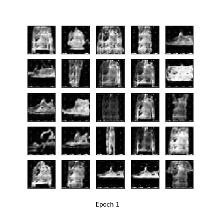
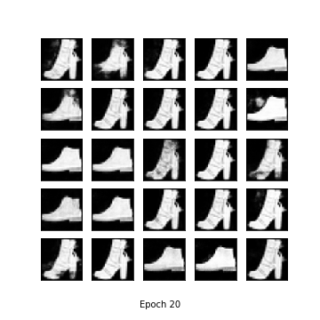
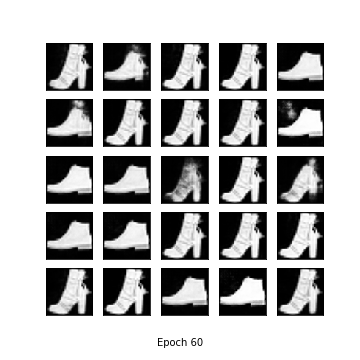

## Few shot image generation using DCGAN (FashionMNIST):

- Initial training was done on images with label zero to eight.

- Fine tuning with four images of label nine.

----

### Result at Epoch 1:

### Result at Epoch 20:

### Result at Epoch 60:

