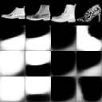
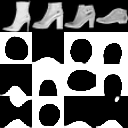

# FIGR
Few-shot Image Generation with Reptile

The gist of this project is that the Reptile meta-learning algorithm is compatible with the GAN setup, unlike the more popular MAML meta-learning algorithm. We train GAN's for few-shot image generation on previously unseen classes on images through this approach.

# Installation

    $ git clone https://github.com/OctThe16th/FIGR.git
    $ cd FIGR
    $ pip install -r requirements.txt
   
# Usage

    $ python train.py --dataset Mnist & tensorboard --logdir Runs/

For the different command line options, simply write:

    $ python train.py --help

# Results

### Result at Epoch 1:

### Result at Epoch 500:

       
If you use this code for your own projects, please consider __citing the following paper__:

	@article{FIGR2019,
	author = {Louis Clouâtre and Marc Demers},
	title = {FIGR: Few-shot Image Generation with Reptile},
	journal = {CoRR},
	volume = {abs/1901.02199},
	year = 2019,
	ee = {http://arxiv.org/abs/1901.02199},
	month = jan,
	archiveprefix = “arXiv”,
	number = “1901.02199v1”,
	eprint = “1901.02199v1”,
	primaryclass = “cs.CV”,
	nonrefereed = “true”
	}
