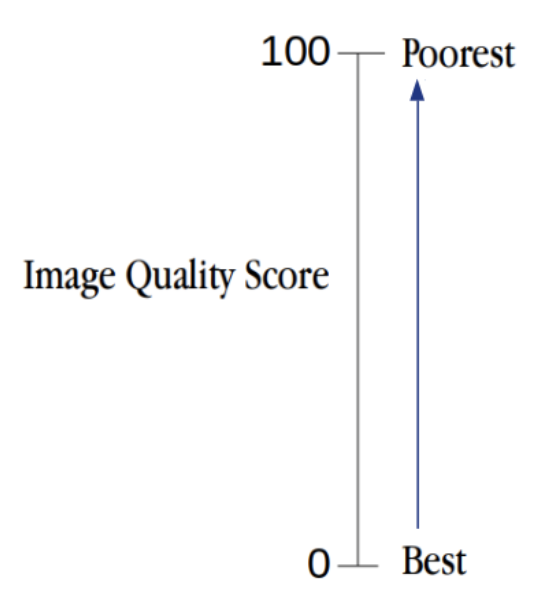
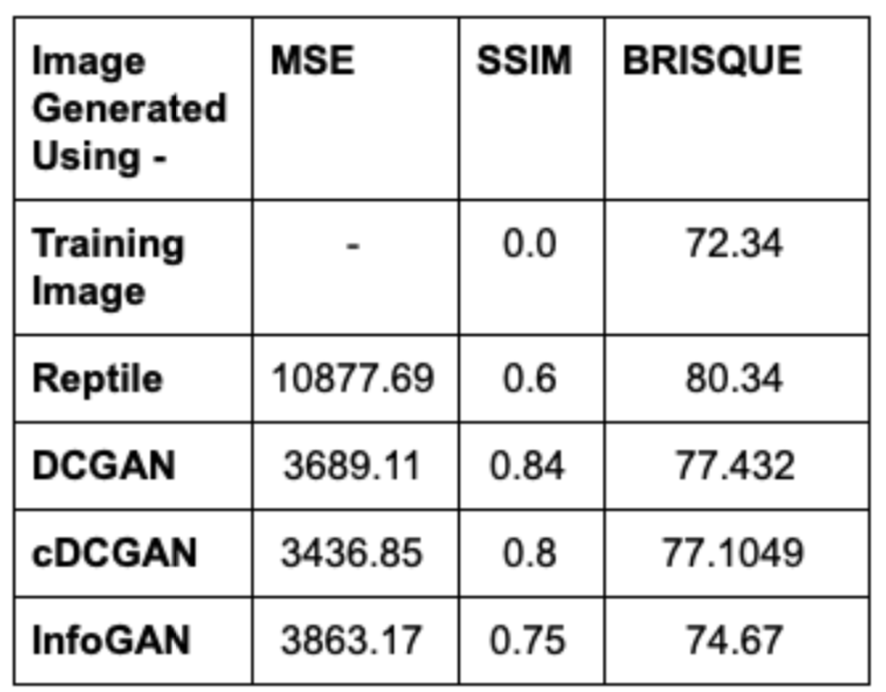

# Few Shot Image Generation

Generating images using GAN: Using four input images

### Methods used:

1) FIGR: Meta-training DCGAN with Reptile

2) Transfer learning and data augmentation with following GAN architectures:

- DCGAN
- cDCGAN
- InfoGAN

----
## Dataset

## Evaluation Metrics:

1) **MSE (Mean Squared Error)**: MSE calculates the mean squared error between each pixels for the two images we are comparing.

---

2) **SSIM (Structural SIMilarity)**: The SSIM index is a method for measuring the similarity between two images. The SSIM index can be viewed as a quality measure of one of the images being compared, provided the other image is regarded as of perfect quality. It looks for similarities within pixels; i.e. if the pixels in the two images line up and or have similar pixel density values.

SSIM puts everything in a scale of -1 to 1. A score of 1 means they are very similar and a score of -1 means they are very different. 

---

3) **BRISQUE (Blind/Referenceless Image Spatial Quality Evaluator)**: It extracts the point wise statistics of local normalized luminance signals and measures image naturalness (or lack there of) based on measured deviations from a natural image model. We also model the distribution of pairwise statistics of adjacent normalized luminance signals which provides distortion orientation information.

